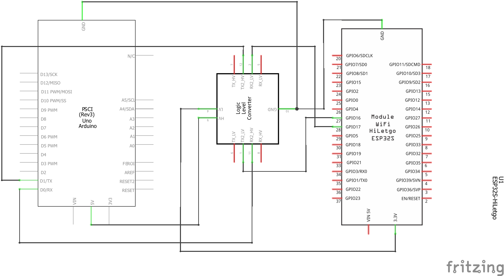
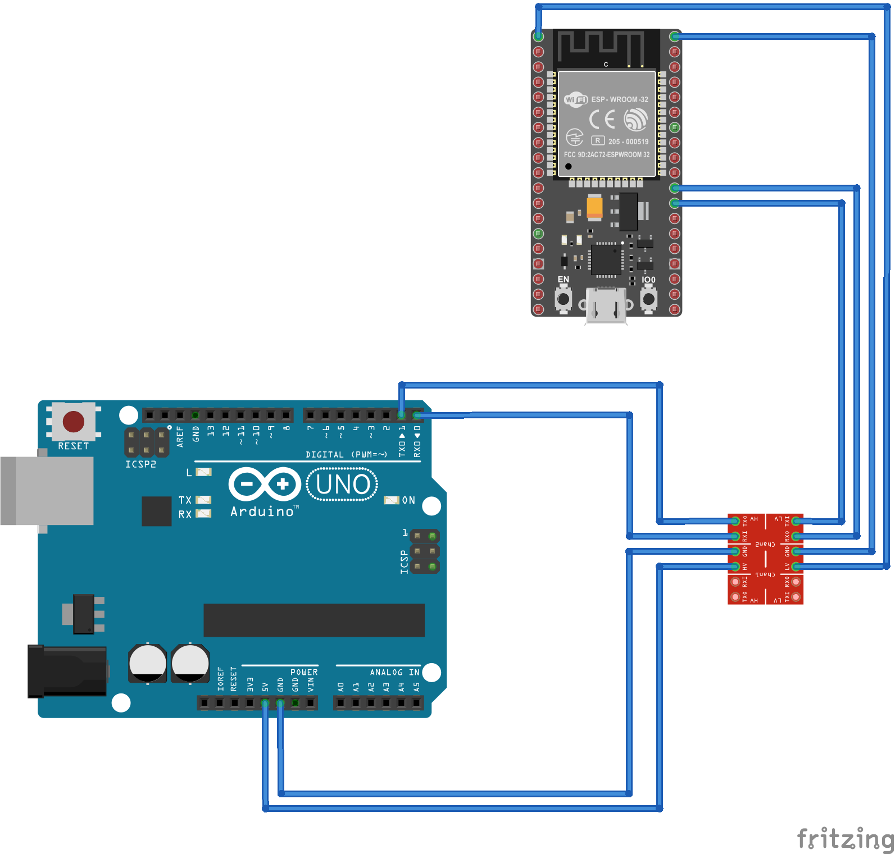

# Arduino -> Esphome
Here is a example how to write sensor values from a Arduino to the esphome device.

## Schematics
Connect the UART ports from both devices with a level shifter in between. The level shifter is necessary for the 5v Arduino to 3.3v ESP32.




## Configuration

### Arduino
Open the `sketch-esphome-uart-p2p.ino` with Arduino IDE. There is already a sample included that sends each 5s a random number (0-100) to the esphome device.

### Esphome
Configure the esphome device like this:

```yaml
esp32:
  board: esp32dev
  framework:
    type: arduino

external_components:
  - source:
      url: github://KG3RK3N/esphome-uart-p2p
      type: git
    components: [uart_p2p_receiver]

# Enable logging
logger:

wifi:
  ssid: !secret wifi_ssid
  password: !secret wifi_password

captive_portal:

web_server:
  port: 80

uart:
  - id: uart_1
    tx_pin: GPIO17
    rx_pin: GPIO16
    baud_rate: 115200

uart_p2p_receiver:
  - uart_id: uart_1
    sensors:
      - id: receiver_sensor_arduino
        name: "Arduino sensor"
        address: 0x01
```